# 🔄 AgentX - Data Flow Architecture

**Complete data flow for the Vercel AI SDK-powered autonomous agent**

---

## 📋 What This Document Covers

1. High-Level Architecture
2. User Request Complete Flow
3. Tool Calling Flow
4. Proactive Engine Flow
5. Database Interactions
6. Memory & Learning Flow

---

## 1. High-Level System Architecture

```mermaid
graph TB
    User[👤 User] --> Frontend[Next.js Frontend]
    
    Frontend --> ChatAPI[/api/chat]
    
    subgraph "Agentic Core"
        ChatAPI --> Executor[Agentic Executor]
        Executor --> StreamText[streamText()]
        StreamText --> Groq[Groq GPT-120B]
        StreamText --> Tools[23 Tools]
    end
    
    subgraph "Proactive Engine"
        Triggers[Background Triggers]
        Predictions[ML Predictions]
        Cache[15-min Cache]
    end
    
    Tools --> Services[Business Services]
    Services --> DB[(Supabase PostgreSQL)]
    
    Groq <--> Tools
    Triggers --> DB
    Predictions --> DB
    Cache --> Executor
    
    Groq --> Response[Streamed Response]
    Response --> Frontend
    
    style Executor fill:#4CAF50
    style Groq fill:#FF9800
    style DB fill:#9C27B0
```

---

## 2. Complete User Request Flow

### From User Message to Response

```mermaid
sequenceDiagram
    autonumber
    
    participant User
    participant UI as React UI
    participant API as /api/chat
    participant Executor as Agentic Executor
    participant Proactive as Proactive Engine
    participant Groq as Groq GPT-120B
    participant Tools
    participant DB as Supabase
    
    User->>UI: "ابي احدث خبرتي تصير 10 سنوات"
    UI->>API: POST {messages, user_id}
    
    API->>Executor: executeAgenticAgent()
    
    Note over Executor: Step 1: Check Proactive Cache
    Executor->>Proactive: getProactiveData(userId)
    Proactive->>DB: Query user behavior & events
    DB-->>Proactive: {predictions, events}
    Proactive-->>Executor: Cached/Fresh data
    
    Note over Executor: Step 2: Build Messages
    Executor->>Executor: Add system prompt + history + user message
    
    Note over Executor: Step 3: Call Groq with Tools
    Executor->>Groq: streamText({model, tools, maxSteps: 10})
    
    Note over Groq: Iteration 1: LLM decides
    Groq->>Executor: Tool call: getResume({user_id})
    
    Executor->>Tools: Execute getResume
    Tools->>DB: SELECT FROM resumes
    DB-->>Tools: {experience_years: 5}
    Tools-->>Executor: Result
    
    Note over Groq: Iteration 2: LLM processes result
    Executor->>Groq: Send tool result
    Groq->>Executor: Tool call: updateResume({experience_years: 10})
    
    Executor->>Tools: Execute updateResume
    Tools->>DB: UPDATE resumes
    DB-->>Tools: Success
    Tools-->>Executor: {success: true}
    
    Note over Groq: Iteration 3: Final response
    Executor->>Groq: Send final tool result
    Groq-->>Executor: "تم تحديث خبرتك إلى 10 سنوات ✅"
    
    Note over Executor: Non-blocking DB saves
    Executor->>DB: Save conversation (fire-and-forget)
    Executor->>DB: Update user behavior (fire-and-forget)
    
    Executor-->>API: Stream response
    API-->>UI: Server-sent events
    UI->>User: Display response
```



**Key Points:**
- ⚡ Non-blocking DB writes (fire-and-forget)
- 🔄 Multi-step tool chaining (maxSteps: 10)
- 📦 Proactive cache (15-min TTL, 92% hit rate)
- 🚀 Streaming response (real-time UI updates)

---

## 3. Tool Calling Flow

### How Vercel AI SDK Handles Tools


### Tool Definition Example

```typescript
// Vercel AI SDK format
import { tool } from 'ai'
import { z } from 'zod'

export const updateResume = tool({
  description: 'Update resume fields. Call getResume first.',
  parameters: z.object({
    user_id: z.string().uuid(),
    experience_years: z.number().int().min(0).max(50).optional()
  }),
  execute: async ({ user_id, experience_years }) => {
    // Business logic
    return await updateResumeInDB(user_id, { experience_years })
  }
})
```

---

## 4. Proactive Engine Flow

### Background Monitoring System


**Cache Performance:**
- TTL: 15 minutes
- Hit Rate: 92%
- Reduces proactive engine calls by 10x

---

## 5. Database Interactions

### Schema Overview


### Data Flow Patterns

**Read Flow:**
```
Tool → Service → Supabase Client → PostgreSQL → Return Data
```

**Write Flow (Non-blocking):**
```
Executor → fire-and-forget → Save to DB (async)
```

**Proactive Flow:**
```
Cron → Triggers → Detect Events → Cache → Executor
```

---

## 6. Memory & Learning Flow

### How Agent Learns


---

## 🔧 Tech Stack

**AI Layer:**
- Vercel AI SDK (`ai` package)
- Groq GPT-OSS-120B (500 T/s)
- Zod (parameter validation)

**Backend:**
- Next.js API Routes
- Supabase PostgreSQL
- TypeScript

**Frontend:**
- React 19
- Next.js 15
- Tailwind CSS

---

**This reflects the ACTUAL implementation** using Vercel AI SDK + Groq! 🚀
