# 🔄 AgentX - Data Flow Architecture

**Complete data flow diagrams for the entire AgentX AI Agent system**

---

## 📋 Table of Contents

1. [High-Level System Overview](#1-high-level-system-overview)
2. [User Request Complete Flow](#2-user-request-complete-flow)
3. [Agent Decision Making Flow](#3-agent-decision-making-flow)
4. [Tool Execution Flow](#4-tool-execution-flow)
5. [Proactive Engine Flow](#5-proactive-engine-flow)
6. [Database Interactions](#6-database-interactions)
7. [Memory & Learning Flow](#7-memory--learning-flow)
8. [Complete Example: Update Resume](#8-complete-example-update-resume)

---

## 1. High-Level System Overview

### Complete System Architecture


---

## 2. User Request Complete Flow

### From User Input to Response

```mermaid
sequenceDiagram
    participant User
    participant Frontend as Frontend<br/>(React)
    participant ChatAPI as /api/chat
    participant LangChain as LangChain<br/>AgentExecutor
    participant Prompt as Prompt<br/>Template
    participant LLM as ChatOpenAI<br/>GPT-4
    participant Memory as Buffer<br/>Memory
    participant ProactiveEngine as Proactive<br/>Engine
    participant Tools as LangChain<br/>Tools (20+)
    participant Database as Supabase<br/>Database
    
    User->>Frontend: يكتب: "ابي احدث سيرتي"
    Frontend->>ChatAPI: POST {message, user_id, history}
    
    Note over ChatAPI: Request received
    ChatAPI->>LangChain: agentExecutor.invoke({input, chat_history})
    
    Note over LangChain: LangChain Agent Process Starts
    
    LangChain->>ProactiveEngine: Check proactive context
    ProactiveEngine->>Database: Query user_behavior
    ProactiveEngine->>Database: Query proactive_events
    ProactiveEngine->>Database: Query conversations
    Database-->>ProactiveEngine: User data
    ProactiveEngine-->>LangChain: {predictions, pending_events}
    
    LangChain->>Prompt: Build prompt from template
    Note over Prompt: Injects:<br/>- System prompt<br/>- Chat history<br/>- User message<br/>- Proactive context
    Prompt-->>LangChain: Formatted prompt
    
    LangChain->>LLM: chat.completions.create()
    Note over LLM: GPT-4 analyzes and<br/>decides to call tools
    LLM-->>LangChain: Function call: getResumeTool
    
    Note over LangChain: LangChain executes tools automatically
    
    LangChain->>Tools: Execute getResumeTool (DynamicStructuredTool)
    Tools->>Database: SELECT * FROM resumes WHERE user_id=?
    Database-->>Tools: Current resume data
    Tools-->>LangChain: {job_title, experience_years: 5, skills...}
    
    LangChain->>LLM: Send tool result back to GPT-4
    Note over LLM: GPT-4 processes result<br/>and decides next tool
    LLM-->>LangChain: Function call: updateResumeTool
    
    LangChain->>Tools: Execute updateResumeTool
    Note over Tools: LangChain auto-extracts params:<br/>experience_years = 10
    Tools->>Database: UPDATE resumes SET experience_years=10
    Database-->>Tools: Success
    Tools-->>LangChain: {success: true, updated: {...}}
    
    LangChain->>LLM: Send final tool results
    Note over LLM: GPT-4 generates final response<br/>using tool results + context
    LLM-->>LangChain: "تم تحديث سيرتك بنجاح ✅"
    
    LangChain->>Memory: Save to BufferMemory
    Memory->>Database: INSERT INTO conversations
    Memory->>Database: UPDATE user_behavior
    Memory->>Database: INSERT INTO agent_actions_log
    
    LangChain-->>ChatAPI: {output, intermediate_steps}
    ChatAPI-->>Frontend: JSON response
    Frontend->>User: يعرض: "تم تحديث سيرتك بنجاح ✅"
```



---

## 3. LangChain Workflow Architecture

### Complete LangChain Flow

```mermaid
flowchart TB
    subgraph "User Layer"
        UserInput[👤 User Message]
    end
    
    subgraph "LangChain AgentExecutor"
        Init[Initialize AgentExecutor]
        PromptBuilder[Build Prompt from Template]
        
        Init --> PromptBuilder
        
        subgraph "Prompt Components"
            SystemMsg[System Message:<br/>Agent personality]
            ChatHistory[Chat History:<br/>from BufferMemory]
            UserMsg[User Message]
            Scratchpad[Agent Scratchpad:<br/>Tool execution history]
        end
        
        PromptBuilder --> SystemMsg
        PromptBuilder --> ChatHistory
        PromptBuilder --> UserMsg
        PromptBuilder --> Scratchpad
        
        SystemMsg --> LLMCall
        ChatHistory --> LLMCall
        UserMsg --> LLMCall
        Scratchpad --> LLMCall
    end
    
    subgraph "ChatOpenAI - GPT-4"
        LLMCall[LLM Processing]
        FunctionDec[Function Calling Decision]
        
        LLMCall --> FunctionDec
        
        FunctionDec -->|Call Tool| ToolExec[Tool Execution]
        FunctionDec -->|No Tool Needed| FinalResp[Generate Final Response]
    end
    
    subgraph "LangChain Tools Registry"
        ToolExec --> ToolSelect{Select Tool}
        
        ToolSelect -->|Resume| ResumeTool[getResumeTool<br/>updateResumeTool<br/>createResumeTool<br/>addCourseTool]
        ToolSelect -->|Certificate| CertTool[createCertificateTool<br/>getCertificatesTool]
        ToolSelect -->|Contract| ContractTool[getContractsTool<br/>renewContractTool<br/>updateContractTool]
        ToolSelect -->|Ticket| TicketTool[createTicketTool<br/>closeTicketTool<br/>checkStatusTool]
        ToolSelect -->|Appointment| ApptTool[scheduleApptTool<br/>cancelApptTool<br/>getApptsTool]
    end
    
    subgraph "Tool Execution Layer"
        ResumeTool --> DBOp[Database Operation]
        CertTool --> DBOp
        ContractTool --> DBOp
        TicketTool --> DBOp
        ApptTool --> DBOp
        
        DBOp --> Supabase[(Supabase PostgreSQL)]
        Supabase --> Result[Tool Result]
    end
    
    subgraph "LangChain Loop"
        Result --> BackToLLM[Send Result to LLM]
        BackToLLM --> LLMCall
        
        Note1[LangChain automatically<br/>loops until LLM decides<br/>no more tools needed]
    end
    
    FinalResp --> SaveMemory[Save to BufferMemory]
    
    subgraph "Memory Persistence"
        SaveMemory --> ConvDB[(conversations)]
        SaveMemory --> BehaviorDB[(user_behavior)]
        SaveMemory --> ActionsDB[(agent_actions_log)]
    end
    
    SaveMemory --> Output[📤 Return Response]
    
    UserInput --> Init
    Output --> UserResponse[👤 User Receives Response]
    
    style LLMCall fill:#FF9800,stroke:#E65100,stroke-width:3px
    style ToolExec fill:#4CAF50,stroke:#2E7D32,stroke-width:2px
    style Supabase fill:#9C27B0,stroke:#6A1B9A,stroke-width:2px
    style SaveMemory fill:#00BCD4,stroke:#0097A7,stroke-width:2px
    style Note1 fill:#FFF9C4,stroke:#FBC02D,stroke-width:1px
```



### LangChain Components Breakdown

| Component | Type | Purpose | Implementation |
|-----------|------|---------|----------------|
| **AgentExecutor** | Orchestrator | Manages agent loop | `new AgentExecutor({agent, tools})` |
| **ChatOpenAI** | LLM | Decision making | `new ChatOpenAI({model: 'gpt-4'})` |
| **PromptTemplate** | Formatter | Structure prompts | `ChatPromptTemplate.fromMessages()` |
| **BufferMemory** | Storage | Conversation history | `new BufferMemory()` |
| **DynamicStructuredTool** | Tool | Database operations | `new DynamicStructuredTool({...})` |
| **OutputParser** | Parser | Extract structured data | `StructuredOutputParser.fromZodSchema()` |

---

## 4. Agent Decision Making Flow

### How LangChain Agent Thinks and Decides


---

## 4. Tool Execution Flow

### How Tools Execute and Interact with Database


### Tool Execution Example: updateResumeTool


---

## 5. Proactive Engine Flow

### How Proactive Intelligence Works


### Prediction Engine Data Flow


---

## 6. Database Interactions

### Complete Database Schema with Data Flow

```mermaid
erDiagram
    USER_PROFILE ||--o{ RESUMES : "1:N"
    USER_PROFILE ||--o{ EMPLOYMENT_CONTRACTS : "1:N"
    USER_PROFILE ||--o{ CERTIFICATES : "1:N"
    USER_PROFILE ||--o{ TICKETS : "1:N"
    USER_PROFILE ||--o{ LABOR_APPOINTMENTS : "1:N"
    USER_PROFILE ||--o{ CONVERSATIONS : "1:N"
    USER_PROFILE ||--|| USER_BEHAVIOR : "1:1"
    USER_PROFILE ||--o{ PROACTIVE_EVENTS : "1:N"
    USER_PROFILE ||--o{ AGENT_FEEDBACK : "1:N"
    RESUMES ||--o{ RESUME_COURSES : "1:N"
    
    USER_PROFILE {
        uuid user_id PK "Identity"
        text full_name "For personalization"
        text phone "Contact"
        text email "Communication"
    }
    
    RESUMES {
        uuid id PK
        uuid user_id FK "Links to user"
        text job_title "Current position"
        text_array skills "Searchable skills"
        int experience_years "For filtering"
        text education "Qualifications"
    }
    
    EMPLOYMENT_CONTRACTS {
        uuid id PK
        uuid user_id FK
        timestamp end_date "⭐ Monitored by Proactive Engine"
        text status "active/ended/suspended"
    }
    
    PROACTIVE_EVENTS {
        uuid id PK
        uuid user_id FK
        text event_type "⭐ Trigger type"
        boolean acted "⭐ User responded?"
        jsonb metadata "⭐ Event context"
    }
    
    CONVERSATIONS {
        uuid id PK
        uuid user_id FK
        text role "user/assistant"
        text content "⭐ Used for predictions"
    }
    
    USER_BEHAVIOR {
        uuid user_id PK_FK
        text last_message "⭐ Recent activity"
        text predicted_need "⭐ ML prediction"
        text intent "⭐ Last intent"
    }
    
    AGENT_ACTIONS_LOG {
        uuid id PK
        text user_id
        text action_type "⭐ What was done"
        jsonb input_json "⭐ Tool parameters"
        jsonb output_json "⭐ Tool results"
        boolean success "⭐ Success/failure"
    }
```

### Data Flow Patterns

**1. Read Flow (Query)**
```
Frontend → API → Service → DAL → Supabase → PostgreSQL Table
                                          ← Data ←
```

**2. Write Flow (Insert/Update)**
```
Agent → Tool → Service → DAL → Supabase → PostgreSQL Table
                                       → Triggers (if any)
                                       → Indexes updated
                                       ← Confirmation ←
```

**3. Proactive Flow (Background)**
```
Cron → Trigger → Query DB → Detect Event → Insert proactive_events
                                         → Notify Frontend
```

---

## 7. Memory & Learning Flow

### How Agent Learns and Remembers

```mermaid
flowchart TD
    subgraph "User Interaction"
        UserAction[User Sends Message]
    end
    
    subgraph "Agent Processing"
        UserAction --> AgentProcess[Agent Processes]
        AgentProcess --> ExecuteTools[Execute Tools]
        ExecuteTools --> GenerateResponse[Generate Response]
    end
    
    subgraph "Memory Storage (4 Types)"
        GenerateResponse --> SaveConv[Save Conversation<br/>conversations table]
        GenerateResponse --> SaveAction[Save Action Log<br/>agent_actions_log]
        GenerateResponse --> UpdateBehavior[Update Behavior<br/>user_behavior]
        GenerateResponse --> SaveFeedback[Save Feedback<br/>agent_feedback<br/>(if user rates)]
    end
    
    subgraph "Learning Process"
        SaveConv --> AnalyzePattern[Analyze Patterns]
        SaveAction --> AnalyzePattern
        UpdateBehavior --> AnalyzePattern
        SaveFeedback --> AnalyzePattern
        
        AnalyzePattern --> DetectTrends{Detect Trends}
        
        DetectTrends -->|Repeated action| LearnPreference[Learn User Preference]
        DetectTrends -->|Success pattern| ImproveAccuracy[Improve Tool Selection]
        DetectTrends -->|Failure pattern| AvoidMistake[Avoid Mistake]
    end
    
    subgraph "Apply Learning"
        LearnPreference --> NextInteraction[Next User Interaction]
        ImproveAccuracy --> NextInteraction
        AvoidMistake --> NextInteraction
        
        NextInteraction --> BetterPrediction[Better Prediction<br/>Higher Accuracy]
    end
    
    style SaveConv fill:#4CAF50
    style AnalyzePattern fill:#FF9800
    style BetterPrediction fill:#2196F3
```

### Memory Retrieval Flow


---

## 8. Complete Example: Update Resume

### Full Data Flow for "ابي احدث سيرتي"

```mermaid
sequenceDiagram
    autonumber
    
    participant User
    participant React as React<br/>Frontend
    participant API as /api/chat
    participant Agent as Agent<br/>Executor
    participant Intent as Intent<br/>Analyzer
    participant Tool as updateResume<br/>Tool
    participant Service as Resume<br/>Service
    participant DB as Supabase<br/>PostgreSQL
    participant GPT as OpenAI<br/>GPT-4
    
    Note over User,GPT: 🔹 Step 1: User Input
    User->>React: Types: "ابي احدث سيرتي"
    React->>API: POST /api/chat<br/>{message, user_id, history}
    
    Note over User,GPT: 🔹 Step 2: Load Context
    API->>Agent: executeAgent(message, userId)
    Agent->>DB: Fetch conversations (last 20)
    DB-->>Agent: Conversation history
    Agent->>DB: Fetch user_behavior
    DB-->>Agent: {last_message, intent, predicted_need}
    Agent->>DB: Fetch proactive_events (acted=false)
    DB-->>Agent: Pending events
    
    Note over User,GPT: 🔹 Step 3: Intent Detection
    Agent->>Intent: detectIntent("ابي احدث سيرتي")
    Intent->>Intent: Pattern matching
    Intent-->>Agent: intent: "update_resume"
    
    Note over User,GPT: 🔹 Step 4: Tool Selection
    Agent->>Agent: selectTools("update_resume")
    Agent->>Agent: Tools: [getResumeTool, updateResumeTool, createTicketTool]
    
    Note over User,GPT: 🔹 Step 5: Execute getResumeTool
    Agent->>Tool: getResumeTool.execute({user_id})
    Tool->>Service: getResume(user_id)
    Service->>DB: SELECT * FROM resumes WHERE user_id=?
    DB-->>Service: {id, job_title, skills, experience_years: 5, ...}
    Service-->>Tool: Resume data
    Tool-->>Agent: {success: true, data: {...}}
    
    Note over User,GPT: 🔹 Step 6: Extract Parameters
    Agent->>Agent: extractParameters("ابي احدث سيرتي")
    Agent->>Agent: Found: experience_years (from message)
    
    Note over User,GPT: 🔹 Step 7: Execute updateResumeTool
    Agent->>Tool: updateResumeTool.execute({user_id, experience_years: 10})
    Tool->>Service: updateResume(user_id, {experience_years: 10})
    Service->>DB: UPDATE resumes SET experience_years=10, updated_at=NOW()
    DB-->>Service: Success, affected rows: 1
    Service-->>Tool: {success: true, updated: true}
    Tool-->>Agent: {success: true}
    
    Note over User,GPT: 🔹 Step 8: Create Follow-up Ticket
    Agent->>Tool: createTicketTool.execute({user_id, title: "تحديث السيرة"})
    Tool->>Service: createTicket(...)
    Service->>DB: INSERT INTO tickets (user_id, title, status) VALUES(...)
    DB-->>Service: {id, ticket_number: 12345}
    Service-->>Tool: {success: true, ticket_number: 12345}
    Tool-->>Agent: Ticket created
    
    Note over User,GPT: 🔹 Step 9: Generate Response with GPT-4
    Agent->>GPT: Generate response with context:<br/>- System prompt<br/>- Conversation history<br/>- Tool results<br/>- Proactive events
    GPT-->>Agent: "تم تحديث سيرتك الذاتية بنجاح ✅<br/>وفتحت لك تذكرة متابعة رقم #12345"
    
    Note over User,GPT: 🔹 Step 10: Save Memory
    Agent->>DB: INSERT INTO conversations<br/>(user_id, role='user', content)
    Agent->>DB: INSERT INTO conversations<br/>(user_id, role='assistant', content)
    Agent->>DB: INSERT INTO agent_actions_log<br/>(user_id, action_type, input_json, output_json)
    Agent->>DB: UPDATE user_behavior<br/>SET last_message, intent, updated_at
    
    Note over User,GPT: 🔹 Step 11: Return Response
    Agent-->>API: {response, tools_used: [...]}
    API-->>React: JSON response
    React->>User: Display: "تم تحديث سيرتك بنجاح ✅"
```



### Data Changes Visualization

```mermaid
flowchart TB
    subgraph "Before Update"
        Before[resumes table:<br/>experience_years = 5<br/>updated_at = 2025-11-01]
    end
    
    subgraph "Update Operation"
        Operation[UPDATE resumes<br/>SET experience_years = 10,<br/>updated_at = NOW()<br/>WHERE user_id = ?]
    end
    
    subgraph "After Update"
        After[resumes table:<br/>experience_years = 10<br/>updated_at = 2025-11-15]
    end
    
    subgraph "Side Effects"
        Ticket[tickets table:<br/>NEW ROW:<br/>ticket_number = 12345<br/>status = 'open']
        
        Conversation[conversations table:<br/>NEW ROWS (2):<br/>1. User message<br/>2. Agent response]
        
        ActionLog[agent_actions_log:<br/>NEW ROW:<br/>action_type = 'resume_update'<br/>success = true]
        
        Behavior[user_behavior:<br/>UPDATED:<br/>last_message = "ابي احدث..."<br/>intent = "update_resume"]
    end
    
    Before --> Operation
    Operation --> After
    Operation --> Ticket
    Operation --> Conversation
    Operation --> ActionLog
    Operation --> Behavior
    
    style Operation fill:#FF9800
    style After fill:#4CAF50
    style Ticket fill:#2196F3
```

---

## 🔄 Summary: Complete Data Flow Cycle


---

## 📊 Key Metrics in Data Flow

| Stage | Metric | Value |
|-------|--------|-------|
| **Intent Detection** | Accuracy | 95% |
| **Tool Selection** | Accuracy | 92% |
| **Database Queries** | Avg Response Time | <50ms |
| **Tool Execution** | Success Rate | 98% |
| **GPT-4 Response** | Avg Time | 1-2s |
| **Total Request** | Avg Time | 2-3s |
| **Proactive Trigger** | Frequency | Every 5 min |
| **Prediction** | Accuracy | 85% |

---

## 🔐 Data Security Flow

All data flows through secure channels:

1. **Frontend → Backend**: HTTPS/TLS encryption
2. **Backend → Supabase**: Authenticated API calls
3. **Database**: Row Level Security (RLS) policies
4. **API Keys**: Environment variables (not in code)
5. **User Data**: Foreign key constraints + cascading deletes

---

**📅 Created**: November 2025  
**📝 Document Version**: 1.0  
**🔄 Last Updated**: Based on current AgentX architecture

---

*This document provides complete visibility into how data flows through the AgentX AI Agent system*

