# 🔗 Vercel AI SDK Workflow - Complete Guide

**How Vercel AI SDK powers AgentX's autonomous agent with tool calling**

---

## 📋 Overview

AgentX uses **Vercel AI SDK** (`ai` package) with **Groq** as the LLM provider to create a true agentic system with autonomous tool calling.

**Key Technologies:**
- ✅ **Vercel AI SDK** - Framework for AI agent
- ✅ **Groq** - Ultra-fast LLM inference (GPT-OSS-120B)
- ✅ **Zod** - Type-safe parameter validation
- ✅ **Supabase** - PostgreSQL database

---

## 🏗️ Architecture

```mermaid
graph TB
    User[User Message] --> Executor[Agentic Executor]
    
    subgraph "Vercel AI SDK Core"
        Executor --> StreamText[streamText()]
        StreamText --> Model[Groq GPT-120B]
        StreamText --> Tools[23 Tools with Zod]
        
        Model <--> ToolCall[Tool Calling]
        ToolCall <--> Tools
    end
    
    Tools --> Services[Business Services]
    Services --> DB[(Supabase)]
    
    Model --> Response[Streamed Response]
    
    style Executor fill:#4CAF50,stroke:#2E7D32,stroke-width:3px
    style Model fill:#FF9800,stroke:#E65100,stroke-width:3px
    style Tools fill:#2196F3,stroke:#1565C0,stroke-width:2px
```

---

## 🔄 Complete Workflow

### Step 1: Initialize Agent

```typescript
// app/ai/agent/executor-agentic.ts
import { streamText } from 'ai'
import { agentModel } from './groq-client'  // Groq GPT-120B
import { AGENTIC_TOOLS } from './tools-agentic'

export async function executeAgenticAgent(
  userMessage: string,
  userId: string,
  conversationHistory: any[] = []
) {
  // Build context with proactive events
  const messages = buildMessages(userMessage, userId, conversationHistory)
  
  // LLM with autonomous tool calling
  const result = streamText({
    model: agentModel,        // Groq GPT-OSS-120B
    messages: messages,
    tools: AGENTIC_TOOLS,     // 23 tools
    maxSteps: 10,             // Multi-step chaining
    temperature: 0.3,         // Deterministic
    
    onStepFinish: async (step) => {
      // Log tool calls
      if (step.toolCalls?.length > 0) {
        console.log('Tools called:', step.toolCalls.map(tc => tc.toolName))
      }
    },
    
    async onFinish({ text, toolCalls, toolResults }) {
      // Save to database (non-blocking)
      saveConversation(userId, 'user', userMessage).catch(console.error)
      saveConversation(userId, 'assistant', text).catch(console.error)
    }
  })
  
  return { response: result, isStream: true }
}
```

---

### Step 2: Tool Definitions

```typescript
// app/ai/agent/tools-agentic.ts
import { tool } from 'ai'
import { z } from 'zod'
import { ALL_TOOLS } from '../tools'

export const updateResume = tool({
  description: `Update user's resume fields. Supported fields:
    - job_title: Job title in Arabic
    - experience_years: Number (0-50)
    - education: Education level
    IMPORTANT: Call getResume first to see current values.`,
  
  parameters: z.object({
    user_id: z.string().uuid(),
    job_title: z.string().min(2).optional(),
    experience_years: z.number().int().min(0).max(50).optional(),
    education: z.string().optional(),
    summary: z.string().optional(),
    skills: z.array(z.string()).optional()
  }),
  
  execute: async (params) => {
    console.log('🔧 [LLM CALL] updateResume:', params)
    const result = await ALL_TOOLS.updateResumeTool.execute(params)
    console.log('📊 [RESULT]', result.success ? '✅' : '❌')
    return result
  }
})

// 23 total tools defined similarly...
export const AGENTIC_TOOLS = {
  getResume,
  updateResume,
  createCertificate,
  renewContract,
  // ... 19 more
}
```

---

### Step 3: LLM Decision Flow

```mermaid
sequenceDiagram
    autonumber
    
    participant User
    participant Executor
    participant Groq as Groq GPT-120B
    participant Tools
    participant DB

    User->>Executor: "ابي احدث خبرتي تصير 10 سنوات"
    
    Note over Executor: Iteration 1
    Executor->>Groq: streamText with 23 tools
    
    Note over Groq: Analyzes intent<br/>Decides: need current data
    Groq->>Executor: Tool call: getResume
    
    Executor->>Tools: Execute getResume
    Tools->>DB: SELECT * FROM resumes
    DB-->>Tools: {experience_years: 5}
    Tools-->>Executor: Tool result
    
    Note over Executor: Iteration 2
    Executor->>Groq: Send with tool result in context
    
    Note over Groq: Sees: current=5, wants=10<br/>Decides: update needed
    Groq->>Executor: Tool call: updateResume({experience_years: 10})
    
    Executor->>Tools: Execute updateResume
    Tools->>DB: UPDATE resumes
    DB-->>Tools: Success
    Tools-->>Executor: {success: true}
    
    Note over Executor: Iteration 3
    Executor->>Groq: Send with both tool results
    
    Note over Groq: Has all info<br/>Generates response
    Groq->>User: "تم تحديث خبرتك إلى 10 سنوات ✅"
```



---

## 🛠️ Tool Calling System

### How Vercel AI SDK Handles Tools

```typescript
// Under the hood (Vercel AI SDK)
const result = streamText({
  model: agentModel,
  tools: AGENTIC_TOOLS,
  maxSteps: 10
})

// SDK automatically:
// 1. Sends tool schemas to Groq
// 2. Receives tool calls from LLM
// 3. Executes tools
// 4. Sends results back to LLM
// 5. Repeats until LLM generates final response
```

### Tool Execution Flow


---

## 🎯 Real Example

### User: "ابي احدث سنوات خبرتي تصير 10"

**LLM Reasoning (autonomous):**
```
Step 1: User wants experience_years = 10
        I should check current value first
        → Call getResume({user_id})
        
Result: experience_years = 5

Step 2: Current is 5, user wants 10
        → Call updateResume({user_id, experience_years: 10})
        
Result: {success: true}

Step 3: Both tools succeeded
        → Generate natural response
```

**Response:**
```
"تم تحديث سنوات خبرتك من 5 إلى 10 سنوات بنجاح ✅"
```

---

## 📊 Key Benefits

| Feature | Vercel AI SDK | Benefit |
|---------|---------------|---------|
| **streamText** | Streaming responses | Real-time UI updates |
| **tool()** | Easy tool definition | Clean, type-safe tools |
| **Zod schemas** | Auto parameter validation | No manual parsing |
| **maxSteps** | Multi-step chaining | Complex workflows |
| **Groq** | 500 tokens/sec | Ultra-fast responses |
| **onStepFinish** | Callback hooks | Observability |

---

## 🚀 Performance

**Metrics:**
- LLM Speed: 500 tokens/sec (Groq)
- Average Steps: 2-3 per request
- Tool Call Latency: ~200ms
- Total Response: 2-3 seconds

**Optimizations:**
- 15-min proactive cache → 92% hit rate
- Non-blocking DB writes → No blocking
- Temperature 0.3 → Deterministic tool calls

---

## 🔧 Tech Stack

```typescript
{
  "ai": "^4.20.0",              // Vercel AI SDK
  "@ai-sdk/groq": "^1.0.0",     // Groq provider
  "zod": "^3.22.0",             // Schema validation
  "@supabase/supabase-js": "^2.0.0"  // Database
}
```

---

**This is the ACTUAL implementation** - Vercel AI SDK + Groq, not LangChain!
